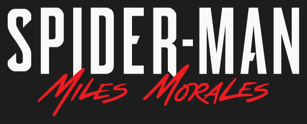
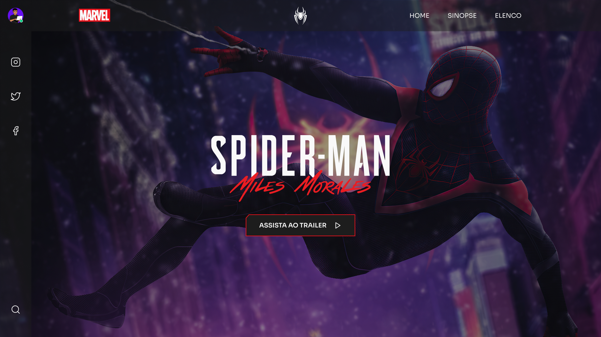

<p align="center">
  
</p>

<p align="center">Projeto para mostrar detalhes sobre o jogo Spider-man Miles Morales.</p>

<p align="center">
  <a href="#-como-executar">Como executar</a>&nbsp;&nbsp;&nbsp;|&nbsp;&nbsp;&nbsp;
  <a href="#-tecnologias-utilizadas">Tecnologias Utilizadas</a>&nbsp;&nbsp;&nbsp;|&nbsp;&nbsp;&nbsp;
  <a href="#-licença">Licença</a>
</p>

## 💻 Preview

<div>
  
</div>

## 🚀 Como executar

- Você precisa instalar o [Node.js](https://nodejs.org/en/) e [Yarn](https://yarnpkg.com/) para executar este projeto.

**Clone o projeto**

```bash
  git clone https://github.com/FlavioSant/spider-man.git
```

**Siga os passo abaixo**

```bash
  # Instale as dependências
  yarn
  # Execute o projeto
  yarn dev
```

O projeto estará sendo executado em modo de desenvolvimento em seu navegador: `http://localhost:3000`

## ✨ Tecnologias utilizadas

Esse projeto foi desenvolvido com as seguintes tecnologias:

- [React](https://reactjs.org)
- [TypeScript](https://www.typescriptlang.org/)
- [CRA](https://create-react-app.dev/)

## 📄 Licença

Esse projeto está sob a licença MIT. Veja o arquivo [LICENSE](LICENSE) para mais detalhes.
